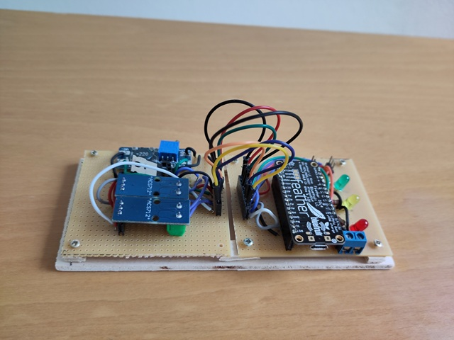

# Smart Card Changer

## Introduction
The Smart Card Changer enables remote access to up to five smart cards, such as access or bank cards, using a single smart card reader. Through a Bluetooth connection, you can conveniently insert or eject cards via your smartphone. The smart card changer is especially useful when the smart card reader is connected to a PC located in a different room.

The smart card changer has three components:

- The Mechanical Structure
- The Control Module
- The Overload Protection Module

The mechanical structure is constructed using basswood sheets and wooden cylinders. It uses two micro servo motors for a linear and a rotational motion. Try it out the online, [interactive 3D model](smartcc.netlify.app).

The control module uses an Adafruit BLE feather board, which controls the two servo motors and is used for the Bluetooth connection with a smartphone.

The overload protection module monitors the electrical current drawn by the servo motors and automatically interrupts the circuit in the event of an overload.

Tooling
- A small lathe to cut the wooden cylinders to length
- Fretsaw or carpet knife to cut the basswood sheets
- Soldering station

The material costs are approximately $120.

## Supplies

- 1 HID  Omnikey USB smart cards reader/writer, version 3021
- 1 Adafruit Feather 32u4 Bluefruit LE
- 2 PDI-9180MG micro servo motor

**Mechanical Structure**

- 2 basswood sheets, 4 mm thick, DIN A3
- 1 prototyping board, approximately 10 cm x 20 cm
- 1 cardboard, DIN A4
- 4 felt mats with 20 mm diameter
- anti-static foam, approximately 7 cm x 7 cm
- 5 hex screws M6 x 18 mm
- 5 wing nuts M6
- 24 screws M2 x 10 mm
- 12 screws M2 x 16 mm

**Control Module**

- 3 LEDs in different colors
 - 3 resistors 100 ohm
 - male headers with 32 pins
 - female headers for 8 pins
 - 1 power connector for 5V DC

**Overload Protection Module**

 - 1 step-up converter. This is required because the transistor requires 5 VDC and the Adafruit feather provides 3.3 VDC
 - 1 transistor IRF520 (or similar)
 - 2 ACS712 current measurement modules
 - 1 female header for 8 pins the overload protection module

## Step 1: Basic Structure

The basic structure is the structural base for both the carriage and the rotator.

On the left side in the image are the rails for the carriage. The two cylinders on the right side are for the rotator platform. The two cylinders in the center are used to adjust the height of the rotator.

Dimensions and Positions:

- 2 cylinders with the height of 50 mm. They are located 15 mm from the longitudinal side and 150 mm from the rear side
- 2 cylinders with the height of 40 mm. They are located 10mm from the longitudinal side and 28 mm from the rear side
- 4 cylinders with the height of 20 mm. They are located 10 mm from the longitudinal and 10 mm from the front sides
- A basswood piece 350 mm x 140 mm. The slot for the servo motor has a size of 25 mm x 12 mm and the distance to the rear side is 63 mm
- 4 basswood pieces 170 mm x 20 mm
- 2 basswood pieces 170 mm x 10 mm
- 4 felt mats with 20 mm diameter

## Step 2: Carriage and Servo arm

The carriage is the part that slides in the rails of the basic structure. In the center of the image is the servo arm extension and on the right the servo arm. The servo arm is mounted onto the servo motor.

Dimensions and Positions:

- 2 cylinders with the height of 46 mm. They are located 10 mm and 55 mm from the front side
- 1 cylinder with the height of 9.7 mm. It is located 10 mm from the front side. The diameter of the hole in the center is 5.2 mm
- 3 cylinders with the the height of 3 mm. The diameter of the hole in the center is 5 mm
- 2 bolts with a 5 mm diameter and a length of 24 mm
- 1 basswood piece 119 mm x 95 mm. The hole for the spacer is locate 10 mm from the front side and has a diameter of 5 mm
- 1 basswood piece 175 mm x 15 mm. The holes are located 10 mm from the front sides with a diameter of 5.2 mm
- 1 basswood piece 70 mm x 15 mm. One hole is located 10 mm from the front side with a diameter of 5.2 mm. One hole is located 20 mm from the front side and has a diameter of 6 mm

## Step 3: Card Reader Platform

The card reader platform is used for the Omnikey Smart Card Reader and is mounted onto the carriage assembly. The black segments in the image are anti-static foam and used to fixate the card reader. Anti-static foam is commonly used for packaging integrated circuits.

Dimensions and Positions:

- 1 basswood piece 120 mm x 90 mm
- 4 basswood pieces 30 mm x 15 mm. 2 pieces are located at the front side with a in-between distance of 64 mm.  2 pieces are located 38 mm from the front side in a 45 degree angle
-  2 basswood pieces 30 mm x 20 mm
- 4 pieces of anti-static foam

## Step 4: Rotator Platform

The rotator platform is mounted onto the basic structure. It has a ramp on both sides to mechanically adjust the height of the rotator.

Dimensions and Positions:

- 4 cylinders with the height of 8 mm. The cylinders are located 10 mm from the edge.
- 2 basswood pieces 58 mm x 20 mm
- 1 basswood piece 140 mm x 56 mm. The slot for the servo motor has a size of 25 mm x 12 mm and the distance to both the rear and the front side is 15.5 mm

## Step 5: Rotator

The rotator is mounted onto the rotator platform. The angle between the card slots is 30 degrees. The card slots are cut out of cardboard which is glued onto the rotator. The cards are fixated with hexagon screws.

The mechanical adjustment is part of this step. Use the 4 adjustment screws until each card slot has the same height as the card reader mouth.

Dimensions and Positions:

- 1 large basswood piece 300 mm x 215 mm. The rotation center is located 65 mm from the rear side. The radius for the card slots is 150 mm (215 - 65). The card fixation screws are located 35 mm from the front side for each card slot.
- 1 cardboard with the cut out card slots. The slots have a dimension of 54 mm x 30 mm

## Step 6: Rotator Lids

With the rotator lid, the cards are fixated to the rotator. Cardboard pieces are glued to the lids. The cardboard pieces prevent the card from being pulled out by the reader.

Dimensions and Positions:

- 5 basswood pieces 60 mm x 79 mm. The angle of the side edges is 15 degrees towards the rotation center
- 5 cardboard pieces 46 mm x 15 mm
- 10 cardboard pieces 46 mm x 5 mm

## Step 7: Control Module

The smart card changer is already operational with the control module. In the next step, the control module is tested and the smart card changer is calibrated

Parts

 - 3 LEDs in different colors
 - 3 resistors 100 ohm
 - 2 male headers with 3 pins to connect the servo motors
 - 1 male header with 12 pins
 - 1 male header with 17 pins
 - 1 female header for 8 pins the overload protection module
 - 1 power connector for 5V DC

## Step 8: Test and Calibrate

To operate the smart card changer without the overload protection module, add a shortcut wire as shown in the image above. Power is supplied to the smart card changer via a USB connection to the host PC..

Download and unzip the *CalibrationApp.zip*. Open the sketch *CalibrationApp.ino* in the Arduino IDE upload it to the control module.

Plug in the servo motors and the servo motors move to the initial position.

In the Arduino IDE, open the Serial Monitor.

1. The prompt shows "Erase memory? [y/n]". The calibration is stored on the EEPROM - existing data is overwritten. Choose "y" to continue
2. "Position: ". Type in "r" for *rotation servo*  
3. "Position: ". Type in "1500". The rotator moves to a new position
4. "Position: ". Type in "l" for *longitudinal servo*  
5. "Position: ". Type in 1000. The carriage moves to a new position

**Longitudinal Calibration**

Choose "l" for *longitudinal servo* and position the carriage to fully retracted, then 1 cm, 2 cm, 3 cm, ... , 7 cm towards the rotator. Write down the position values for each step.

| mm   | servo |
| ---- | ----- |
| 0    | 950   |
| 10    | 1090   |
| 20    | 1180   |
| 40    | 1330   |
| 60    | 1505   |
| 70    | 1630   |
> Example calibration longitudinal axis, 16. Aug. 2025

The calculated polynomial coefficients  (polynomial of 3 degree)

| polynomial degree | servo |
| ---- | ----- |
| 0    | 9.5199345532256200e+002   |
| 1    | 1.5448059970614935e+001   |
| 2    | -2.3899425671160265e-001   |
| 3    | -2.3899425671160265e-001   |
> Example coefficients longitudinal axis, 16. Aug. 2025

**Rotational Calibration**

For the rotational axis we cannot overlook the mechanical play (backlash).

Choose "r" for *rotation servo*. Calibrate the card slots in clockwise and counter clockwise direction. Write down the position values for each step. The backlash is the ccw position minus the cw position.

| degrees   | coefficient |
| ---- | ----- |
| 30    | 1105   |
| 60    | 1270   |
| 90    | 1435   |
| 120    | 1602   |
| 150    | 1765   |
> Example calibration rotational axis clockwise, 16. Aug. 2025

| degrees   | servo | backlash |
| ---- | ----- | --- |
| 30    | 1085   | -20 |
| 60    | 1245   | -25 |
| 90    | 1410   | - 25 |
| 120    | 1585  | -17|
| 150    | 1745  | - 20|
> Example calibration rotational axis counter clockwise, 16. Aug. 2025

The calculated polynomial coefficients for the clockwise rotation  (polynomial of 3 degree)
| polynomial degree | coefficient |
| ---- | ----- |
| 0    | 9.4440000000000009e+002   |
| 1    | 5.2730158730158729e+000   |
| 2    | 3.1746031746031746e-003   |
| 3    | -1.2345679012345678e-005 |
> Example coefficients rotational axis, 16. Aug. 2025

The calculated polynomial coefficients for the counter clockwise backlash (polynomial of 2 degree)
| polynomial degree | coefficient |
| ---- | ----- |
| 0    | -3.3799999999999997e+001   |
| 1    | 4.0761904761904760e-001,   |
| 2    | -6.3492063492063492e-004   |
> Example coefficients backlash, 16. Aug. 2025

Back in the Serial Monitor, the polynomial coefficients are stored in the EEPROM

- "Position: ". Type in "w" for *write to EEPROM*. Follow the instructions on save the calibration data to the EEPROM.

## Step 9: Overload Protection Module

The overload protection module is optional - smart card changer can be operated without it. Without the protection module, the smart cards could be damaged though.

Then connect the overload module to the control module.

Parts:

 - 1 step-up converter. This is required because the transistor requires 5 VDC and the Adafruit feather provides 3.3 VDC
 - 1 transistor IRF520 (or similar)
 - 2 ACS712 current measurement modules
 - 1 female header for 8 pins the overload protection module

## Step 10: Test and Operate

The smart card changer can be powered via three options:

- USB connection to the PC.
- USB cable linked to an AC/DC power adapter
- Through dedicated power plugs. 

To use it with Bluetooth, the smart card changer functions independently and does not require a physical connection to the PC.

Download and unzip the *SccApp.zip* and the *library.zip*. Copy the content of the library.zip into *Documents\Arduino\libraries*. Open the sketch *SccApp.ino* in the Arduino IDE upload it to the control module.

**Test with USB**

In the Arduino IDE, open the Serial Monitor.

1. Erase the content of the serial monitor and type in "?" for help. The available commands are shown

2. Type in "a" to insert the card in the first card slot. The rotator rotates to the first card slot and the carriage moves forward.

3. Type in "r" to retract the carriage. The carriage moves to the initial position.

   

**Test with Bluetooth**

Install a Bluetooth (BLE) compatible terminal app on your smart phone to use the smart card changer with Bluetooth. These two apps have been verified to work reliably:

- Serial Bluetooth Terminal
- Bluefruit Connect from Adafruit

When connected, send an "a" to insert the smart card in the first slot. Send "r" to retract the carriage to the initial position. The slots are "a", "b", "c", "d", "e". If you send a "p" for *panic*, the carriage goes instantly to the initial position.

That is the Smart Card Changer.

